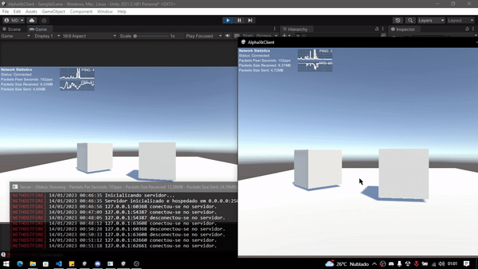
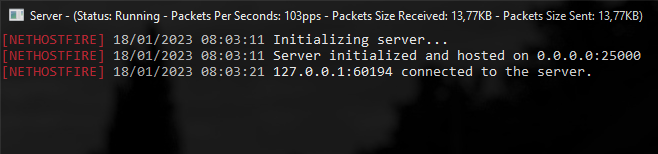
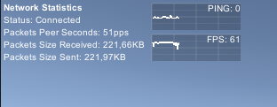

# Nethostfire


Nethostfire is a library (netstandard2.0) to create UDP server and client in C#, with encryption support, Unity 3D integration and several other advanced features to facilitate communication between client and server.



## Donate
 - Brazil
 PIX: trevias@live.com
 - International
 Paypal: trevias@live.com

## Main features
 - PPS bandwidth control for each connected client.
 - PPS bandwidth control for each groupID of shipments.
 - Connected client detection system.
 - Manage all connected clients with server resources.
 - Various types of submissions (single, group, all).
 - RSA, AES and Base64 encryption both on the server and on the client.
 - Automatic decryption.
 - Resource to send UDP bytes without losses.
 - Adapted to manipulate objects in Unity 3D.
 - Adapted for Cross-Server creation.
 - Adapted for high performance.
 - Connection statistics interface in Unity for the client.
   
## Unity installation
1 - Download the library **Nethostfire.dll** in [Releases](https://github.com/treviasxk/Nethostfire/releases)

2 - Move the file to the Assets folder of your Unity project **Assets/bin/debug/Nethostfire.dll**.

3 - Then import the library `'using Nethostfire;'` in your scripts.

## .NET | VB.Net Project Installation
1 - Download the library **Nethostfire.dll** in [Releases](https://github.com/treviasxk/Nethostfire/releases)

2 - Move the file to the root folder of your .NET project.

3 - To add as a reference to your project, add the following xml tags to your project's .csproj file.

```xml
<Project Sdk="Microsoft.NET.Sdk">
  <ItemGroup>
    <Reference Include="Nethostfire.dll">
      <HintPath>Nethostfire.dll</HintPath>
      <SpecificVersion>False</SpecificVersion> 
    </Reference>
  </ItemGroup>
 ...
</Project>
```
4 - Then import the library `'using Nethostfire;'` into your scripts and then restore the project with `'dotnet restore'`.

# Documentation
- Server
    - [Server.Start](#ServerStart)
    - [Server.Restart](#ServerRestart)
    - [Server.Stop](#ServerStop)
    - [Server.SendBytes](#ServerSendBytes)
    - [Server.SendBytesGroup](#SendBytesGroup)
    - [Server.SendBytesAll](#SendBytesAll)
    - [Server.DisconnectClient](#DisconnectClient)
    - [Server.DisconnectClientGroup](#DisconnectClientGroup)
    - [Server.DisconnectClientAll](#DisconnectClientAll)
    - [Server.ChangeLimitMaxByteSizeGroupID](#ChangeLimitMaxByteSizeGroupID)
    - [Server.ChangeLimitMaxPacketsPerSecondsGroupID](#ChangeLimitMaxPacketsPerSecondsGroupID)
    - [Server.ChangeBlockIP](#ChangeBlockIP)
    - [Server.LimitMaxByteReceive](#LimitMaxByteReceive)
    - [Server.LimitMaxPacketsPerSeconds](#LimitMaxPacketsPerSeconds)
    - [Server.Status](#Status)
    - [Server.LostPackets](#LostPackets)
    - [Server.MaxClients](#MaxClients)
    - [Server.PacketsPerSeconds](#PacketsPerSeconds)
    - [Server.PacketsBytesReceived](#PacketsBytesReceived)
    - [Server.PacketsBytesSent](#PacketsBytesSent)
    - [Server.ReceiveAndSendTimeOut](#ReceiveAndSendTimeOut)
    - [Server.UnityBatchModeFrameRate](#UnityBatchModeFrameRate)
    - [Server.ClientsCount](#ClientsCount)
    - [Server.ShowDebugConsole](#ShowDebugConsole)
    - [Server.OnConnectedClient](#OnConnectedClient)
    - [Server.OnDisconnectedClient](#OnDisconnectedClient)
    - [Server.OnServerStatusConnection](#OnServerStatusConnection)
    - [Server.OnReceivedNewDataClient](#OnReceivedNewDataClient);
- Client
    - [Client.Connect](#Connect)
    - [Client.SendBytes](#ClientSendBytes)
    - [Client.DisconnectServer](#DisconnectServer)
    - [Client.Status](#ClientStatus)
    - [Client.LostPackets](#ClientLostPackets)
    - [Client.PacketsPerSeconds](#ClientPacketsPerSeconds)
    - [Client.PacketsBytesReceived](#ClientPacketsBytesReceived)
    - [Client.PacketsBytesSent](#ClientPacketsBytesSent)
    - [Client.ReceiveAndSendTimeOut](#ClientReceiveAndSendTimeOut)
    - [Client.ConnectTimeOut](#ConnectTimeOut)
    - [Client.ShowUnityNetworkStatistics](#ShowUnityNetworkStatistics)
    - [Client.ShowDebugConsole](#ShowDebugConsole)
    - [Client.Ping](#Ping)
    - [Client.OnReceivedNewDataServer](#OnReceivedNewDataServer)
    - [Client.OnClientStatusConnection](#OnClientStatusConnection)
    - [Client.PublicKeyRSA](#PublicKeyRSA)
    - [Client.PrivateKeyAES](#PrivateKeyAES)
- Others
    - [SymmetricSizeRSA](#SymmetricSizeRSA)
    - [ServerStatusConnection](#ServerStatusConnection)
    - [ClientStatusConnection](#ClientStatusConnection)
    - [DataClient](#DataClient)
    - [TypeShipping](#TypeShipping)
- FAQ
    - [GroupID](#GroupID)
    - [HoldConnection](#HoldConnection)

## Server

<a name="ServerStart"></a>
### Server.Start
`Server.Start(IPEndPoint _host = null, int _symmetricSizeRSA = 86)`
```cs
Server.Start(new IPEndPoint(IPAddress.Any, 25000, 16));
```
Start the server with specific IP, Port and sets the size of [SymmetricSizeRSA](#SymmetricSizeRSA) if needed. If the server has already been started and then stopped you can call ``Server.Start();`` without defining _host and _symmetricSizeRSA to start the server with the previous settings.

-----

<a name="ServerRestart"></a>
### Server.Restart
`Server.Restart()`
```cs
Server.Restart();
```
If the server is running, you can restart it, all connected clients will be disconnected from the server and new RSA and AES keys will be generated again.

-----

<a name="ServerStop"></a>
### Server.Stop
`Server.Stop()`
```cs
Server.Stop();
```
If the server is running, you can stop it, all connected clients will be disconnected from the server and if you start the server again new RSA and AES keys will be generated.

-----

<a name="ServerSendBytes"></a>
### Server.SendBytes
`Server.SendBytes(byte[] _byte, int _groupID, DataClient _dataClient, TypeShipping _typeShipping = TypeShipping.None, bool _holdConnection = false)`
```cs
static void OnReceivedNewDataClient(byte[] _byte, int _groupID, DataClient _dataClient){
   var _bytes = System.Text.Encoding.ASCII.GetBytes("Hello world!");

   // Sending bytes with groupID 4 to client, without encryption and without HoldConnection
   Server.SendBytes(_byte, 4, _dataClient);

   // Sending bytes with groupID 4 to client, with encryption AES and without HoldConnection
   Server.SendBytes(_byte, 4, _dataClient, TypeShipping.AES);

   // Sending bytes with groupID 4 to client, with encryption RSA and with HoldConnection
   Server.SendBytes(_byte, 4, _dataClient, TypeShipping.RSA, true);
}
```
To send bytes to a client, it is necessary to define the bytes, [GroupID](#GroupID) and [DataClient](#DataClient), the other sending resources such as [TypeShipping](#TypeShipping) and [HoldConnection](#HoldConnection) are optional.

-----

<a name="SendBytesGroup"></a>
### Server.SendBytesGroup
`Server.SendBytesGroup(byte[] _byte, int _groupID, List<DataClient> _dataClients, TypeShipping _typeShipping = TypeShipping.None, DataClient _skipDataClient = null, bool _holdConnection = false)`
```cs
static List<DataClient> PlayersLobby = new List<DataClient>();
static void OnReceivedNewDataClient(byte[] _byte, int _groupID, DataClient _dataClient){
   var _bytes = System.Text.Encoding.ASCII.GetBytes("Play Game");

   // Sending bytes with groupID 2 to all clients on the list
   Server.SendBytesGroup(_byte, 2, PlayersLobby);

   // Sending bytes with groupID 2 to all clients on the list, except for the sending client.
   Server.SendBytesGroup(_byte, 2, PlayersLobby, _skipDataClient: _dataClient);
}
```
To send bytes to a group client, it is necessary to define the bytes, [GroupID](#GroupID) and [List DataClient](#DataClient), the other sending resources such as [TypeShipping](#TypeShipping), SkipDataClient and [HoldConnection](#HoldConnection) are optional.

-----

<a name="SendBytesAll"></a>
### Server.SendBytesAll
`Server.SendBytesAll(byte[] _byte, int _groupID, TypeShipping _typeShipping = TypeShipping.None, DataClient _skipDataClient = null, bool _holdConnection = false)`
```cs
static void OnReceivedNewDataClient(byte[] _byte, int _groupID, DataClient _dataClient){
   var _bytes = System.Text.Encoding.ASCII.GetBytes("Play Game");

   // Sending bytes with groupID 1 to all clients connected.
   Server.SendBytesAll(_byte, _groupID);

   // Sending bytes with groupID 1 to all clients connected, except for the sending client.
   Server.SendBytesGroup(_byte, 2, PlayersLobby, _skipDataClient: _dataClient);
}
```
To send bytes to all clients, it is necessary to define the bytes, [GroupID](#GroupID), the other sending resources such as [TypeShipping](#TypeShipping), SkipDataClient and [HoldConnection](#HoldConnection) are optional.

-----

<a name="DisconnectClient"></a>
### Server.DisconnectClient
`Server.DisconnectClient(DataClient _dataClient)`
```cs
static void OnReceivedNewDataClient(byte[] _byte, int _groupID, DataClient _dataClient){
  Server.DisconnectClient(_dataClient);
}
```
To disconnect a client from server, it is necessary to inform the [DataClient](#DataClient).

-----

<a name="DisconnectClientGroup"></a>
### Server.DisconnectClientGroup
`Server.DisconnectClientGroup(<List>DataClient _dataClient)`
```cs
static List<DataClient> AFKPlayers = new List<DataClient>();
static void OnReceivedNewDataClient(byte[] _byte, int _groupID, DataClient _dataClient){
  Server.DisconnectClientGroup(AFKPlayers);
}
```
To disconnect a group clients from server, it is necessary to inform the [List DataClient](#DataClient).

-----

<a name="DisconnectClientAll"></a>
### Server.DisconnectClientAll
`Server.DisconnectClientAll()`
```cs
static void OnReceivedNewDataClient(byte[] _byte, int _groupID, DataClient _dataClient){
  Server.DisconnectClientAll();
}
```
To disconnect alls clients from server.

-----

<a name="ChangeLimitMaxByteSizeGroupID"></a>
### Server.ChangeLimitMaxByteSizeGroupID
`Server.ChangeLimitMaxByteSizeGroupID(int _groupID, int _limitBytes)`
```cs
Server.ChangeLimitMaxByteSizeGroupID(4, 12);
```
The ChangeLimitMaxByteSizeGroupID will change the maximum limit of bytes of a [GroupID](#GroupID) that the server will read when receiving the bytes, if the packet bytes is greater than the limit, the server will not call the [Server.OnReceivedNewDataClient](#OnReceivedNewDataClient) event with the received bytes. The default value _limitBytes is 0 which is unlimited.

-----

<a name="ChangeLimitMaxPacketsPerSecondsGroupID"></a>
### Server.ChangeLimitMaxPacketsPerSecondsGroupID
`Server.ChangeLimitMaxPacketsPerSecondsGroupID(int _groupID, int _limitPPS)`
```cs
Server.ChangeLimitMaxPacketsPerSecondsGroupID(4, 60);
```
The ChangeLimitMaxPacketsPerSecondsGroupID will change the maximum limit of Packets per seconds (PPS) of a [GroupID](#GroupID), if the packets is greater than the limit in 1 second, the server will not call the [Server.OnReceivedNewDataClient](#OnReceivedNewDataClient) event with the received bytes. The default value is _limitBytes 0 which is unlimited.

-----

<a name="ChangeBlockIP"></a>
### Server.ChangeBlockIP
`Server.ChangeBlockIP(IPEndPoint _ip, int _time)`
```cs
static void OnReceivedNewDataClient(byte[] _byte, int _groupID, DataClient _dataClient){
  // IP blocked per 1 hour
  Server.ChangeBlockIP(_dataClient.IP, 60000 * 60);
}
```
ChangeBlockIP blocks a specific IP for the time defined in milliseconds. If the time is 0 the IP will be removed from the server's blocked IP list.

-----

<a name="ClientsCount"></a>
### Server.ClientsCount
`Read-Only Variable`
```cs
static void OnConnectedClient(DataClient _dataClient){
    int onlines = Server.ClientsCount;
    Console.WriteLine("Has a total of {0} players connected.", onlines);
}
```
The ClientsCount is the total number of clients connected to the server.

-----

<a name="LimitMaxByteReceive"></a>
### Server.LimitMaxByteReceive
`Write/Read Variable`
```cs
// Limit in 12 bytes;
Server.LimitMaxByteReceive = 12;
```
The LimitMaxByteReceive will change the maximum limit of bytes that the server will read when receiving, if the packet bytes is greater than the limit, the server will not call the [Server.OnReceivedNewDataClient](#OnReceivedNewDataClient) event with the received bytes. The default value is 0 which is unlimited.

-----

<a name="LimitMaxPacketsPerSeconds"></a>
### Server.LimitMaxPacketsPerSeconds
`Write/Read Variable`
```cs
// Limit in 60 pps;
Server.LimitMaxPacketsPerSeconds = 60;
```
The LimitMaxPacketsPerSeconds will change the maximum limit of Packets per seconds (PPS), if the packets is greater than the limit in 1 second, the server will not call the [Server.OnReceivedNewDataClient](#OnReceivedNewDataClient) event with the received bytes. The default value is 0 which is unlimited.

-----

<a name="LostPackets"></a>
### Server.LostPackets
`Read-Only Variable`
```cs
static void OnReceivedNewDataClient(byte[] _byte, int _groupID, DataClient _dataClient){
  int LostPackets = Server.LostPackets;
  Console.WriteLine("{0} packets lost", LostPackets);
}
```
LostPackets is the number of packets lost.

-----

<a name="MaxClients"></a>
### Server.MaxClients
`Write/Read Variable`
```cs
Server.MaxClients = 32; // Maximum 32 Clients
```
MaxClients is the maximum number of clients that can connect to the server. If you have many connected clients and you change the value below the number of connected clients, they will not be disconnected, the server will block new connections until the number of connected clients is below or equal to the limit.

-----

<a name="PacketsPerSeconds"></a>
### Server.PacketsPerSeconds
`Read-Only Variable`
```cs
static void OnReceivedNewDataClient(byte[] _byte, int _groupID, DataClient _dataClient){
  string packetsPerSeconds = Server.PacketsPerSeconds;
  Console.WriteLine("{0} Packets Per Seconds", packetsPerSeconds);
}
```
PacketsPerSeconds is the amount of packets per second that happen when the server is sending and receiving.

-----

<a name="PacketsBytesReceived"></a>
### Server.PacketsBytesReceived
`Read-Only Variable`
```cs
static void OnReceivedNewDataClient(byte[] _byte, int _groupID, DataClient _dataClient){
  string packetsBytesReceived = Server.PacketsBytesReceived;
  Console.WriteLine("Received: {0}", packetsBytesReceived);
}
```
PacketsBytesReceived is the amount of bytes received by the server.

-----

<a name="PacketsBytesSent"></a>
### Server.PacketsBytesSent
`Read-Only Variable`
```cs
static void OnReceivedNewDataClient(byte[] _byte, int _groupID, DataClient _dataClient){
  string packetsBytesSent = Server.PacketsBytesSent;
  Console.WriteLine("Sent: {0}", packetsBytesSent);
}
```
PacketsBytesSent is the amount of bytes sent by the server.

-----

<a name="ReceiveAndSendTimeOut"></a>
### Server.ReceiveAndSendTimeOut
`Write/Read Variable`
```cs
Server.ReceiveAndSendTimeOut = 2000;
```
ReceiveAndSendTimeOut defines the timeout in milliseconds for sending and receiving, if any packet exceeds that sending the server will ignore the receiving or sending. The default and recommended value is 1000.

-----

<a name="ShowDebugConsole"></a>
### Server.ShowDebugConsole or Client.ShowDebugConsole
`Write/Read Variable`
```cs
Server.ShowDebugConsole = false;
// Or
Client.ShowDebugConsole = false;
```


The ShowDebugConsole when declaring false, the logs in Console.Write and Debug.Log of Unity will no longer be displayed. The default value is true.

-----

<a name="UnityBatchModeFrameRate"></a>
### Server.UnityBatchModeFrameRate
`Write/Read Variable`
```cs
Server.UnityBatchModeFrameRate = 30;
```

The UnityBatchModeFrameRate limits the fps at which the dedicated server build (batchmode) will run, it is recommended to limit it to prevent the CPU from being used to the maximum. The default value is 60.

-----

<a name="Status"></a>
### Server.Status
`Write/Read Variable`
```cs
if(Server.Status == ServerStatusConnection.Running){
    // Server Running.
}
```
The Status is an enum [Server.ServerStatusConnection](#ServerStatusConnection) with it you can know the current state of the server.

-----

<a name="OnConnectedClient"></a>
### Server.OnConnectedClient
`Event`
```cs
static void Main(string[] args){
    Server.OnConnectedClient += OnConnectedClient;
    Server.Start(new IPEndPoint(IPAddress.Any, 25000));
}

static void OnConnectedClient(DataClient _dataClient){
    Console.WriteLine(_dataClient.IP + " new client conected!");
}
```
OnConnectedClient is an event that you can use to receive the [DataClient](#DataClient) whenever a new client connected.

-----

<a name="OnDisconnectedClient"></a>
### Server.OnDisconnectedClient
`Event`
```cs
static void Main(string[] args){
    Server.OnDisconnectedClient += OnDisconnectedClient;
    Server.Start(new IPEndPoint(IPAddress.Any, 25000));
}

static void OnDisconnectedClient(DataClient _dataClient){
    Console.WriteLine(_dataClient.IP + " new client conected!");
}
```
OnDisconnectedClient is an event that you can use to receive the [DataClient](#DataClient) whenever a new client disconnected.

-----

<a name="OnServerStatusConnection"></a>
### Server.OnServerStatusConnection
`Event`
```cs
static void Main(string[] args){
    Server.OnServerStatusConnection += OnServerStatusConnection;
    Server.Start(new IPEndPoint(IPAddress.Any, 25000));
}

static void OnServerStatusConnection(ServerStatusConnection _status){
    Console.WriteLine("Server Status: " + _status);
}
```
OnServerStatusConnection is an event that returns [Server.ServerStatusConnection](#ServerStatusConnection) whenever the status changes, with which you can use it to know the current status of the server.

-----

<a name="OnReceivedNewDataClient"></a>
### Server.OnReceivedNewDataClient
`Event`
```cs
static void Main(string[] args){
    Server.OnReceivedNewDataClient += OnReceivedNewDataClient;
    Server.Start(new IPEndPoint(IPAddress.Any, 25000));
}

static void OnReceivedNewDataClient(byte[] _byte, int _groupID, DataClient _dataClient){
    Console.WriteLine("[RECEIVED] GroupID: {0} - Message: {1} | Length: {2}", _groupID, Encoding.ASCII.GetString(_byte), _byte.Length);
}
```
OnReceivedNewDataClient an event that returns bytes received, [GroupID](#GroupID) and [DataClient](#DataClient) whenever the received bytes by clients, with it you can manipulate the bytes received.

## Client
<a name="Connect"></a>
### Client.Connect
`Connect(IPEndPoint _host, int _symmetricSizeRSA = 86)`
```cs
Client.Connect(new IPEndPoint(IPAddress.Parse("127.0.0.1"), 25000), 20);
```
Connect to a server with IP, Port and sets the size of [SymmetricSizeRSA](#SymmetricSizeRSA) if needed.

-----

<a name="ClientSendBytes"></a>
### Client.SendBytes
`SendBytes(byte[] _byte, int _groupID, TypeShipping _typeShipping = TypeShipping.None, bool _holdConnection = false)`
```cs
var _bytes = System.Text.Encoding.ASCII.GetBytes("Hello world!");

// Sending bytes with groupID 4 to server, without encryption and without HoldConnection
Client.SendBytes(_byte, 4);

// Sending bytes with groupID 4 to server, with encryption AES and without HoldConnection
Client.SendBytes(_byte, 4, TypeShipping.AES);

// Sending bytes with groupID 4 to server, with encryption RSA and with HoldConnection
Client.SendBytes(_byte, 4, TypeShipping.RSA, true);
```
To send bytes to server, it is necessary to define the bytes and [GroupID](#GroupID), the other sending resources such as [TypeShipping](#TypeShipping) and [HoldConnection](#HoldConnection) are optional.

-----

<a name="DisconnectServer"></a>
### Client.DisconnectServer
`Client.DisconnectServer()`
```cs
Client.DisconnectServer();
```
With DisconnectServer the client will be disconnected from the server.

-----

<a name="ClientLostPackets"></a>
### Client.LostPackets
`Read-Only Variable`
```cs
static void OnReceivedNewDataServer(byte[] _byte, int _groupID, DataClient _dataClient){
  int LostPackets = Client.LostPackets;
  Console.WriteLine("{0} packets lost", LostPackets);
}
```
LostPackets is the number of packets lost.

-----

<a name="ClientPacketsPerSeconds"></a>
### Client.PacketsPerSeconds
`Read-Only Variable`
```cs
static void OnReceivedNewDataServer(byte[] _byte, int _groupID, DataClient _dataClient){
  string packetsPerSeconds = Client.PacketsPerSeconds;
  Console.WriteLine("{0} Packets Per Seconds", packetsPerSeconds);
}
```
PacketsPerSeconds is the amount of packets per second that happen when the client is sending and receiving.

-----

<a name="ClientPacketsBytesReceived"></a>
### Client.PacketsBytesReceived
`Read-Only Variable`
```cs
static void OnReceivedNewDataServer(byte[] _byte, int _groupID, DataClient _dataClient){
  string packetsBytesReceived = Client.PacketsBytesReceived;
  Console.WriteLine("Received: {0}", packetsBytesReceived);
}
```
PacketsBytesReceived is the amount of bytes received by the client.

-----

<a name="ClientPacketsBytesSent"></a>
### Client.PacketsBytesSent
`Read-Only Variable`
```cs
static void OnReceivedNewDataServer(byte[] _byte, int _groupID, DataClient _dataClient){
  string packetsBytesSent = Client.PacketsBytesSent;
  Console.WriteLine("Sent: {0}", packetsBytesSent);
}
```
PacketsBytesSent is the amount of bytes sent by the client.

-----

<a name="ClientReceiveAndSendTimeOut"></a>
### Client.ReceiveAndSendTimeOut
`Write/Read Variable`
```cs
Client.ReceiveAndSendTimeOut = 2000;
```
ReceiveAndSendTimeOut defines the timeout in milliseconds for sending and receiving, if any packet exceeds that sending the client will ignore the receiving or sending. The default and recommended value is 1000.

-----

<a name="OnReceivedNewDataServer"></a>
### Client.OnReceivedNewDataServer
`Event`
```cs
static void Main(string[] args){
    Client.OnReceivedNewDataServer += OnReceivedNewDataServer;
    Client.Connect(new IPEndPoint(IPAddress.Parse("127.0.0.1"), 25000));
}

static void OnReceivedNewDataServer(byte[] _byte, int _groupID){
    Console.WriteLine("[RECEIVED] GroupID: {0} - Message: {1} | Length: {2}", _groupID, Encoding.ASCII.GetString(_byte), _byte.Length);
}
```
OnReceivedNewDataServer an event that returns bytes received and [GroupID](#GroupID) whenever the received bytes by clients, with it you can manipulate the bytes received.

-----

<a name="OnClientStatusConnection"></a>
### Client.OnClientStatusConnection
`Event`
```cs
static void Main(string[] args){
    Client.OnClientStatusConnection += OnClientStatusConnection;
    Server.Start(new IPEndPoint(IPAddress.Any, 25000));
}

static void OnClientStatusConnection(ClientStatusConnection _status){
    Console.WriteLine("Client Status: " + _status);
}
```
OnClientStatusConnection is an event that returns [Client.ClientStatusConnection](#ClientStatusConnection) whenever the status changes, with which you can use it to know the current status of the server.

-----

<a name="Ping"></a>
### Client.Ping
`Read-Only Variable`
```cs
static void OnReceivedNewDataServer(byte[] _byte, int _groupID, DataClient _dataClient){
  string ping = Client.Ping;
  Console.WriteLine("PING: {0}ms", ping);
}
```
Ping returns an integer value, this value is per milliseconds

-----

<a name="PublicKeyRSA"></a>
### Client.PublicKeyRSA
`Read-Only Variable`
```cs
static void OnClientStatusConnection(ClientStatusConnection _status){
    if(_status == ClientStatusConnection.Connected){
        string publicKeyRSA = Client.PublicKeyRSA;
        Console.WriteLine("Public Key RSA: {0}", publicKeyRSA);
    }
}
```
PublicKeyRSA returns the RSA public key obtained by the server after connecting.

-----

<a name="PrivateKeyAES"></a>
### Client.PrivateKeyAES
`Read-Only Variable`
```cs
static void OnClientStatusConnection(ClientStatusConnection _status){
    if(_status == ClientStatusConnection.Connected){
        string privateKeyAES = Client.PrivateKeyAES;
        Console.WriteLine("Private Key AES: {0}", privateKeyAES);
    }
}
```
PrivateKeyAES returns the AES private key obtained by the server after connecting.

-----

<a name="ClientStatus"></a>
### Client.Status
`Write/Read Variable`
```cs
if(Client.Status == ClientStatusConnection.Connected){
    // Client Connected.
}
```
The Status is an enum [Client.ClientStatusConnection](#ClientStatusConnection) with it you can know the current state of the client.

-----

<a name="ConnectTimeOut"></a>
### Client.ConnectTimeOut
`Write/Read Variable`
```cs
Client.ConnectTimeOut = 15000; // 15s
```
ConnectTimeOut is the time the client will be reconnecting with the server, the time is defined in milliseconds, if the value is 0 the client will be reconnecting infinitely. The default value is 10000.

-----

<a name="ShowUnityNetworkStatistics"></a>
### Client.ShowUnityNetworkStatistics
`Write/Read Variable`
```cs
Client.ShowUnityNetworkStatistics = true;
```



When using Nethostfire in Unity and when set the value of ShowUnityNetworkStatistics to true, statistics on the connection between the client and the server will be displayed during game execution.

## Others

<a name="SymmetricSizeRSA"></a>
### SymmetricSizeRSA

SymmetricSizeRSA is the maximum size of bytes you can encrypt with RSA. Remember, the larger the Symmetric, the larger the RSA key, and the longer it will take to encrypt and decrypt. The default value is 86 bytes which represents 1024 bytes of RSA key.
| Symmetric Size (bytes) | RSA Key Size (bytes) | Encryption/Decryption Speed (ms)| Security |
|:---:|:---:|:---|:---:|
| 16  | 464 | 0,00682 Very Fast | Little Safe |
| 22 | 512  | 0,00870 Fast  | Moderate |
| 86 | 1024 | 0,01138 Moderate | Safe |
| 214 | 2048 | 0,01988 Slow | Very Safe |
| 470 | 4096 | 0,02692 Very Slow | Extremely safe |

_The minimum value of symmetricSizeRSA is 16 and the maximum value is 470. Encryption/Decryprion speed may vary depending on your machine's performance_

-----

<a name="DataClient"></a>
### DataClient
```cs
public class DataClient{
    public IPEndPoint IP; // IP Address
    public int PPS; // Packets per second
    public int Ping; // Ping (ms)
    public int Time; // Last time updated by the server.
    public int TimeLastPacket; // Last time received packet.
    public string PublicKeyRSA = null; // RSA key
    public byte[] PrivateKeyAES = null; // private AES key
}
```
The DataClient class is used to store data from a client on the server. It is with this class that the server uses to define a client. The DataClients can be obtained with the following server events [Server.OnReceivedNewDataClient](#OnReceivedNewDataClient), [Client.OnReceivedNewDataServer](#OnReceivedNewDataServer), [Server.OnConnectedClient](#OnConnectedClient) and [Server.OnDisconnectedClient](#OnDisconnectedClient)

-----

<a name="ServerStatusConnection"></a>
### Server.ServerStatusConnection
```cs
public enum ServerStatusConnection{
    Stopped = 0,
    Stopping = 1,
    Running = 2,
    Initializing = 3,
    Restarting = 4,
}
```
The ServerStatusConnection is used to define server states. The ServerStatusConnection can be obtained by the [Server.Status](#Status) variable or with the event [Server.OnServerStatusConnection](#OnServerStatusConnection)

-----

<a name="TypeShipping"></a>
### TypeShipping
```cs
public enum TypeShipping{
    None = 0,
    AES = 1,
    RSA = 2,
    Base64 = 3,
    Compress = 4,
    SkipDecodeBase64 = 5,
    SkipDecompress = 6,
}
```
The TypeShipping is used to define the type of encryption of the bytes when being sent, Encryptions are automatically decrypted whenever it reaches its destination, to prevent it from being automatically decrypted when it arrives at the server, just select the option that begins with Skip.. Below is some information about using each of them.

| TypeShipping | Encryption/Decryption Speed | Security | Shipping Size | Recommended Use |
|:---:|:---|:---|:---:|:---|
| None  | 37000pps Extremely Fast  | Not Safe | Very Little | Argument/Command Line |
| AES  | 31000pps Fast | Moderate  | Little | Coordinates/Actions of a player (game) | 
| RSA  | 1000ps Extremely Slow  | Extremely safe | Big | Login/Messages |
| Base64  | 36000pps Very Fast  | Not Safe | Little | Infos/Status simples |
| Compress  | 30000pps Fast  | Not Safe | Extremely Little | Video/Voice Call |
| OnlyBase64  | 36500pps Very Fast  | Not Safe | Little | Infos/Status simples |
| OnlyCompress  | 33000pps Fast  | Not Safe | Extremely Little | Video/Voice Call |

_Encryption/Decryprion Speed may vary depending on your machine's performance._

-----

<a name="ClientStatusConnection"></a>
### ClientStatusConnection
```cs
public enum ClientStatusConnection{
    Disconnected = 0, // Disconnected by the server
    Disconnecting = 1,
    Connected = 2,
    Connecting = 3,
    ConnectionFail = 4, // No connection to the server
    IpBlocked = 5, // IP blocked by the server
    MaxClientExceeded = 6, // The server has exceeded the limit of connected clients
}
```
The ClientStatusConnection is used to define client states. The ClientStatusConnection can be obtained by the [Client.Status](#ClientStatus) variable or with the event [Client.OnClientStatusConnection](#OnClientStatusConnection)

## FAQ

<a name="GroupID"></a>
### GroupID
GroupID is a way to organize your shipments with high performance, whenever you send bytes with the Server or Client the GroupID will be obtained in the following events: [Server.OnReceivedNewDataClient](#OnReceivedNewDataClient) and [Client.OnReceivedNewDataServer](#OnReceivedNewDataServer).

-----

<a name="HoldConnection"></a>
### HoldConnection
HoldConnection is a feature to avoid packet loss, when you set it to true when sending, if the server or client does not respond back on the same GroupID, it will be in a loop re-sending until it responds with a response from the server or client.