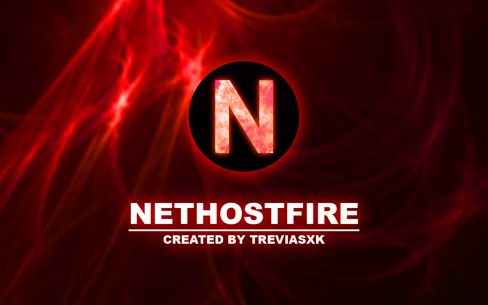
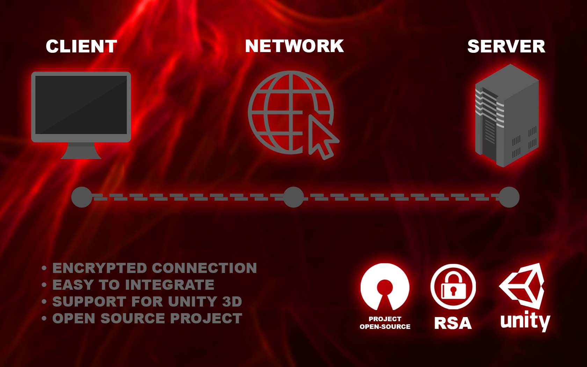

# Nethostfire

Nethostfire é um server/client UDP criado em .NET Core com C# (netstandard2.0), é um projeto simples e de fácil entendimento, os dados são enviado e recebido por byte[] entre o servidor e o client, com ele você pode montar seu servidor de jogos, vídeos chamadas, transferencia de arquivos e entre outros.

## Recursos
  * Envio/Recebimento de dados organizados.
  * Vários tipos de envios (único, grupo, todos).
  * Criptografia RSA Server/Client.
  * Compactar/Descompactar bytes.
  * Adaptado para manipular objetos na Unity 3D.
  * Adaptado para criação de Cross-Server.
  * Adaptado para alta performance.
  * Sistema de detecção de clients conectados.
  * Bloqueio por IP.

## Instalação
### Unity
Baixe a DLL em [Releases](https://github.com/treviasxk/Nethostfire/releases), coloque a DLL dentro da pasta Assets de seu projeto Unity, assim Assets/bin/debug/ServerUDP.dll, Depois é só importar a biblioteca 'using NetworkUDP;' nos seus scripts.
### Projeto .NET | VB.Net
Clona ou baixe o projeto [Nethostfire](https://github.com/treviasxk/Nethostfire) e depois utilize o comando `dotnet add reference <local>/Nethostfire` dentro do seu projeto.