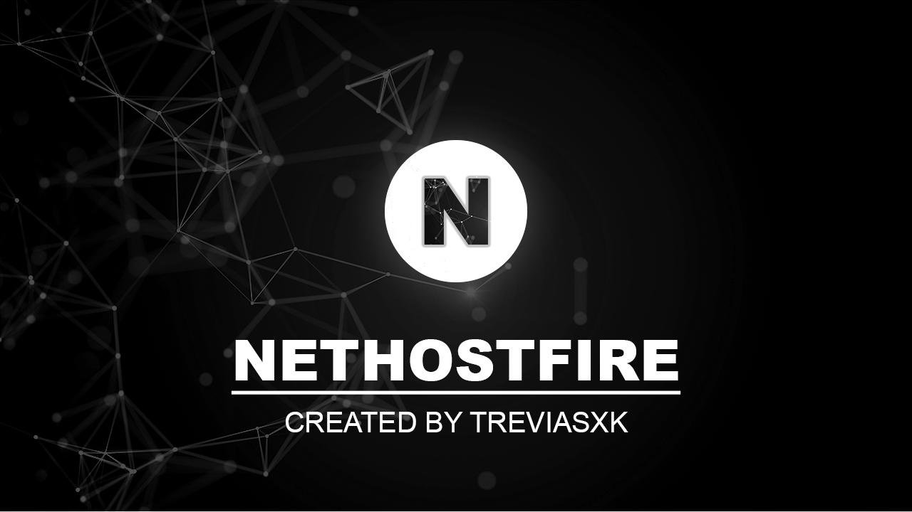

# Nethostfire



Nethostfire is a library (netstandard2.0) to create UDP server and client in C#, with encryption support, Unity 3D integration and several other advanced features to facilitate communication between client and server.


## Donate
 - Brazil
 PIX: trevias@live.com
 - International
 Paypal: trevias@live.com

## Main features
 - PPS bandwidth control for each connected client.
 - PPS bandwidth control for each groupID of shipments.
 - Connected client detection system.
 - Manage all connected clients with server resources.
 - Various types of submissions (single, group, all).
 - RSA, AES and Base64 encryption both on the server and on the client.
 - Automatic decryption.
 - Resource to send UDP bytes without losses.
 - Adapted to manipulate objects in Unity 3D.
 - Adapted for Cross-Server creation.
 - Adapted for high performance.
 - Connection statistics interface in Unity for the client.
   
## Unity installation
1 - Download the library **Nethostfire.dll** in [Releases](https://github.com/treviasxk/Nethostfire/releases)

2 - Move the file to the Assets folder of your Unity project **Assets/bin/debug/Nethostfire.dll**.

3 - Then import the library `'using Nethostfire;'` in your scripts.

## .NET | VB.Net Project Installation
1 - Download the library **Nethostfire.dll** in [Releases](https://github.com/treviasxk/Nethostfire/releases)

2 - Move the file to the root folder of your .NET project.

3 - To add as a reference to your project, add the following xml tags to your project's .csproj file.

```xml
<Project Sdk="Microsoft.NET.Sdk">
  <ItemGroup>
    <Reference Include="Nethostfire.dll">
      <HintPath>Nethostfire.dll</HintPath>
      <SpecificVersion>False</SpecificVersion> 
    </Reference>
  </ItemGroup>
 ...
</Project>
```
4 - Then import the library `'using Nethostfire;'` into your scripts and then restore the project with `'dotnet restore'`.

## Documentation
  - [Server and Client - UDP](UDP/README.md)
  - Server and Client - TCP (Coming soon)

## Projects Examples
  - (Coming soon)